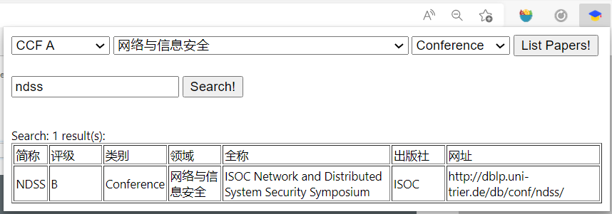

## dblp-highlighter

一个给[dblp.org](dblp.org)的论文查询结果标出会议/期刊等级的浏览器小插件.（不会写前端，现学现卖的，别嫌弃哈哈

### Usage

- 加载到chrome后，会自动在dblp网站运行（两个数据库都支持），搜论文会自动标识会议/期刊信息

  
  

- 点击插件图标，弹窗里可以按照等级/领域/类别的方式列出所有会议/期刊，也可以按照会议简称搜索，忽略大小写（目前不支持模糊搜索，需要准确的简称）

  
  

### References

[中国计算机学会推荐国际学术会议和期刊目录](https://www.ccf.org.cn/Academic_Evaluation/By_category/)  
[CCF 会议期刊推荐目录 2019](https://github.com/magichan/CCF-Recommended-Catalog-2019)  

### Thanks

[AsterNighT/Userscripts](https://github.com/AsterNighT/Userscripts/tree/master/scripts/paperjudge)
